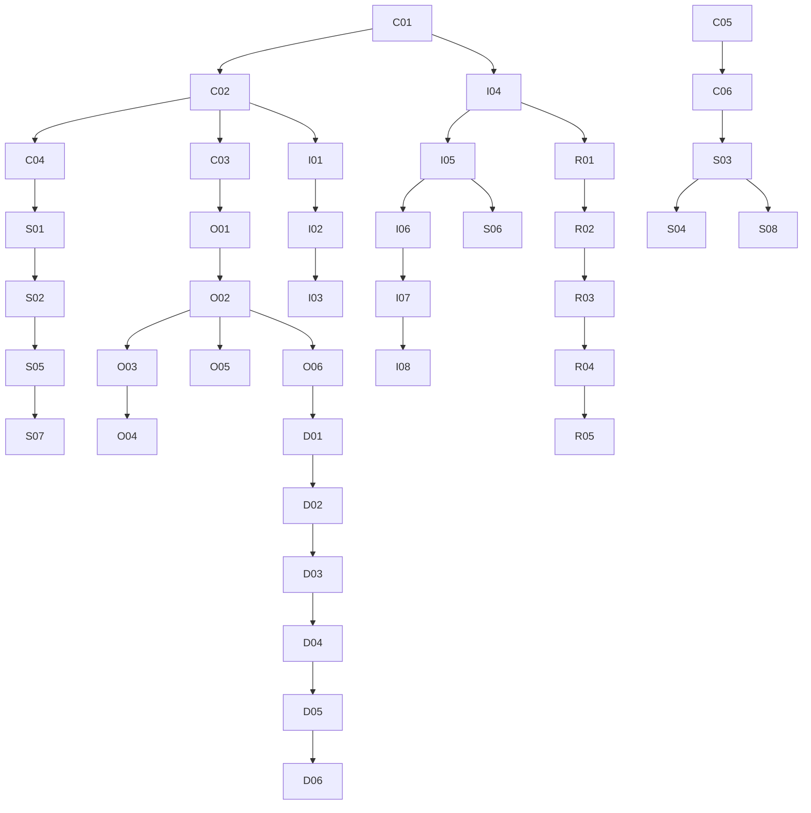

# Watch Assistant 115 影视库整理与 STRM 实施计划

文档版本：V1.0
日期：2026-07-26
依据：

- [`REQ-001：115 影视库自动整理`](../requirements/REQ-001-115-library-organization/README.md)
- [`REQ-002：115 STRM 全量与增量同步`](../requirements/REQ-002-115-strm-sync/README.md)

本计划只覆盖 REQ-001 和 REQ-002。Agent CLI 与中文结构化日志应分别依据 REQ-003、REQ-004 制定独立实施计划。
状态：供产品、研发、测试和运维评审；不代表功能已经上线

## 1. 项目范围说明

### 1.1 目标

项目交付两条彼此解耦、通过持久化事件衔接的能力：

1. 115 影视库整理：受控目录扫描、文件名解析、TMDB 匹配、五类与地区归档、命名计划、人工确认、安全执行、隔离恢复和后续洗版。
2. STRM 输出：受管清单、全量生成、稳定播放入口、动态直链、目录级增量、元数据同步、失效项安全清理、dirty 重入队和失败恢复。

首要成功标准是整理准确和零静默误删，而不是自动化率。所有功能开关默认关闭；Phase 0 未通过前，真实 115 写操作始终不可用。

### 1.2 非目标

- 不做视频转码、封装转换或媒体内容编辑。
- 不替代 Emby、Jellyfin、Plex。
- 不建设公网多租户、角色、配额或计费。
- 不自动处理低置信度匹配。
- 不清理系统受管清单以外的本地或 115 文件。
- 不在 STRM、日志或前端响应中保存 Cookie、完整 play token 或有时效真实直链。

### 1.3 现状分层

| 层级 | 基线 | 已确认能力 | 明确不包含 |
|---|---|---|---|
| Git 正式主线 | `origin/main@42939d0` | TMDB 查询/搜索/季度信息；PanSou 聚合；qB 检测；P115 磁力提交、Cookie readiness 和只读任务列表；SQLite；推送 Task 状态机；设置中心 V1；脱敏 LogStore | 持久 WebSession、资源分页、inspection auto-start、内容策略、托管凭据、115 目录整理、pickcode/直链、STRM |
| 当前已知生产 | `5e32f5f` | 正式主线能力，加持久 WebSession、资源分页、inspection auto-start、Settings V2、内容策略和托管 TMDB/P115 凭据界面；托管值为空，生产来源为 environment/TgtoDrive | 115 影视库整理、pickcode/直链、STRM |
| 已验证功能分支 | `feature/integration-settings-v2@5e32f5f` | Settings V2、内容策略、业务日志、托管 TMDB/P115 凭据、共享 revision；已部署并完成生产验收；托管值仍为空，生产来源为 environment/TgtoDrive | 不包含目录整理或 STRM |
| 本项目拟新增 | 待开发 | 115 影视库整理、目录索引、解析/匹配/规划、STRM 全量/增量、动态播放、元数据、洗版/隔离、运营工作台 | 仍为拟新增、未开发；Phase 0 前不允许任何真实写操作 |

实施基线：`5e32f5f` 已完成生产验收并作为当前生产基线；本项目仍只覆盖拟新增、未开发的 115 影视库整理与 STRM 能力。

## 2. 架构影响分析

### 2.1 可复用模块

| 能力 | 复用方式 | 边界 |
|---|---|---|
| `adapters/tmdb.py` | 复用认证、HTTP 客户端、详情/搜索/别名/季度查询；扩展候选查询和详情字段 | 当前模型不足以承载 genre、keyword、国家、集范围和匹配依据，需要新增领域 DTO，不能把搜索页 `MovieMetadata` 直接当整理身份 |
| `adapters/p115.py` 与 CookieProvider | 复用固定 p115client 版本、Cookie 热加载、readiness、异常脱敏和客户端生命周期 | 当前只覆盖磁力/分享/任务列表，不具备目录、文件详情、pickcode、移动、重命名、建目录、隔离、删除或直链契约；新建独立 `P115LibraryGateway`，避免把现有推送适配器膨胀成万能类 |
| `TaskWorker` / `TaskState` | 复用 lease、重启恢复、uncertain 的设计原则和测试模式 | 现有 `Task` 只服务磁力推送，状态和幂等键不匹配；禁止直接复用同一表。整理、扫描、STRM 各用独立状态模型，共享小型 lease/CAS helper 即可 |
| SQLite/SQLAlchemy | 复用 WAL、异步 session、在线备份和完整性检查 | `create_all` 加少量手工 ALTER 不足以支撑多表演进；Phase 1 前引入版本化、幂等、向前迁移注册表，并以备份回滚 |
| Settings V2 | 复用认证、CSRF、限流、共享 revision、凭据和设置 UI 模式 | 媒体库配置应独立 revision，避免每次扫描参数修改与全局设置互相冲突；凭据仍由现有服务唯一持有 |
| LogStore/observability | 复用结构化业务事件、分类、轮转和脱敏 | 新增 organization/strm/playback 事件分类或稳定 event name；日志只记 ID、计数、状态和错误码，不记完整路径、pickcode、token、Cookie、直链 |
| FastAPI/Vue/Playwright | 复用认证 API、SPA、mock E2E 和桌面/移动布局 | 新增工作台必须采用分页/游标，不把整库或完整操作明细一次返回前端 |

### 2.2 推荐边界

建议新增模块：

- 适配层：`adapters/p115_library.py`、`adapters/p115_playback.py`。
- 领域层：`services/library_index.py`、`media_parser.py`、`media_matcher.py`、`organization_planner.py`、`organization_executor.py`、`replacement.py`。
- STRM：`services/strm_manifest.py`、`strm_sync.py`、`metadata_sync.py`、`directory_queue.py`、`playback.py`。
- API：`api/libraries.py`、`api/organization.py`、`api/strm.py`。
- 数据模型：独立 `library_models.py`，由数据库初始化显式导入；避免继续扩大现有 `models.py`。
- 前端：`views/LibrarySettingsView.vue`、`OrganizationView.vue`、`StrmView.vue`，复用现有设置和分页组件。

建议数据实体：`media_libraries`、`cloud_directories`、`cloud_files`、`scan_runs`、`media_matches`、`organization_plans`、`organization_operations`、`review_items`、`quarantine_records`、`domain_outbox`、`strm_entries`、`strm_sync_jobs`、`directory_dirty_queue`、`metadata_entries`。所有云端身份优先使用稳定 file/directory ID；路径是可变属性，pickcode 是播放属性，不能互相替代。

### 2.3 关键架构缺口

1. 缺少经过验证的 115 文件系统和播放接口。
2. 缺少云端目录/文件快照、扫描完整性和分页游标。
3. 缺少媒体文件解析、候选评分、人工锁定与规则版本。
4. 缺少“计划持久化后执行”的写操作模型、远端前置条件和 uncertain 核对。
5. 缺少 STRM 受管清单、安全本地路径边界、原子写和清理保护。
6. 缺少持久化 outbox/dirty 队列；内存事件不能满足崩溃恢复。
7. 缺少播放入口鉴权契约以及 Emby/Jellyfin/Plex 的 HEAD/Range 行为证据。
8. 缺少版本化数据库迁移和大型目录性能基准。

### 2.4 强制安全不变量

- `library_read_enabled`、`organization_plan_enabled`、`organization_write_enabled`、`strm_full_enabled`、`strm_incremental_enabled`、`replacement_enabled`、`permanent_delete_enabled` 分级开关，默认全部关闭；上一级未通过不得开启下一级。
- 写操作只能引用已持久化计划和当前远端前置条件；超时进入 `uncertain`，只允许核对，不允许自动重写。
- 低/中置信度默认 `needs_review`，人工锁定优先于规则和 TMDB 后续变化。
- 洗版默认仅提示；启用后默认移入隔离区 7 天；永久删除独立开关且默认关闭。
- 清理仅处理受管清单；扫描 `complete=false` 时删除阶段硬关闭。
- STRM 仅含稳定 Watch Assistant 入口和非敏感标识，不含 Cookie、完整 play token 或真实直链。
- REQ-002 明确禁止在 STRM 中嵌入完整 play token。本计划默认验证“LAN/Tailscale allowlist + opaque manifest ID”方案；若需公网鉴权，必须另行产品/安全评审。

## 3. Epic、Feature、User Story 与技术任务

下表每行均可独立建 Issue。`P` 表示前置依赖；相同阶段中未互相依赖的任务可并行。

| ID | Epic / Feature / User Story | 技术任务与主要模块 | P | 测试与完成标准 |
|---|---|---|---|---|
| C01 | E0 契约 / 安全夹具 / 作为研发，我需要脱敏沙箱 | 建立 fake gateway、脱敏 fixture、调用录制器、写操作总开关；`tests/contracts` | 无 | 真实值零输出；fake 可模拟分页、超时、限流、部分成功；默认禁止写 |
| C02 | E0 只读契约 / 浏览目录 | 验证列目录、分页、文件详情、稳定 ID、mtime、size、pickcode 类型 | C01 | 脱敏契约固定；分页重复/漏项测试；取消传播；只读无副作用 |
| C03 | E0 写契约 / 安全整理 | 在专用临时目录验证建目录、移动、重命名、隔离、恢复、回收站/删除；不得接业务 worker | C01,C02 | 每接口记录请求/响应/幂等/错误映射；可精确清理；超时核对方案冻结 |
| C04 | E0 pickcode / 稳定身份 | 形成移动、重命名、账号内复制、目录移动后的 file ID/pickcode 稳定性矩阵 | C02,C03 | 每场景有前后只读证据；确定 manifest 主键和变更规则 |
| C05 | E0 播放 / 动态直链 | 验证直链接口、有效期、HEAD、GET、Range、302/307、限流和 Cookie 失效 | C01,C02 | 脱敏响应契约；不记录签名 URL；缓存键/TTL 和错误码冻结 |
| C06 | E0 播放安全 / 媒体服务器鉴权 | 威胁建模并验证 allowlist + opaque ID；确定撤销和越权边界 | C05 | STRM 无完整 token；库外 pickcode/ID 返回 404/403；安全评审签字 |
| C07 | E0 能力门禁 / 运维可控 | 建立 capability matrix 和 readiness：read/list/write/play/delete 分离 | C02-C06 | 未验证能力为 false；健康接口不夸大；写能力不能由单一 Cookie ready 自动开启 |
| I01 | E1 数据基础 / 可升级数据库 | 实现版本化向前迁移、媒体库/索引/扫描表和在线备份检查 | C02 | 从生产形态 SQLite 升级；旧数据保留；重复迁移幂等；备份回滚演练 |
| I02 | E1 只读索引 / 作为用户我能查看受管目录 | `P115LibraryGateway` 只读面和分页 indexer | C02,I01 | 10k+ fixture 分页；不一次入内存；范围外目录拒绝；取消可恢复 |
| I03 | E1 扫描完整性 / 安全差异 | scan run、checkpoint、snapshot revision、complete 标志和差异集合 | I02 | 中断续扫；分页错误 complete=false；新增可输出、删除候选被禁止 |
| I04 | E2 解析 / 识别文件语义 | 解析电影、S/E、范围、特别篇、分辨率、来源、编码、HDR/DV、音轨、语言、发布组；保留依据 | C01 | 表驱动单测覆盖中英日韩、异常名、样片/花絮；解析幂等 |
| I05 | E2 TMDB 匹配 / 高置信自动、低置信待确认 | 扩展 TMDB DTO；候选评分、分差、季集边界、别名和人工锁定 | I04 | 固定候选 fixture；同名异年/类型冲突/越界降级；低置信永不生成写计划 |
| I06 | E2 分类命名 / 可解释计划 | 五类、地区、模板、非法字符、伴随文件命名和规则版本 | I04,I05 | 五类/四地区/多国/模板/冲突单测；重复规划目标不变 |
| I07 | E2 整理计划 / 预览优先 | 持久化 source snapshot、target、步骤、依据、preconditions、规则版本和 plan hash | I03,I06 | 同源同规则同目标返回同 plan；源变化使旧 plan 失效；无远端写 |
| I08 | E2 工作台 / 人工确认 | 预览、候选选择、季集/分类/地区修改、忽略、别名规则；分页 API/Vue | I05,I07 | 鉴权/CSRF/409；桌面移动 E2E；确认只改变计划状态，不直接写 115 |
| O01 | E3 整理状态机 / 安全执行 | 独立 organization operation + lease worker：planned/organizing/organized/failed/uncertain | C03,I07 | 单元覆盖转换；崩溃恢复；uncertain 禁止普通 retry；不复用推送 Task 表 |
| O02 | E3 写前核对 / 幂等远端操作 | 每步检查 file ID、父目录、名称、目标不存在和已完成后置条件 | O01 | 重放不二次移动；目标冲突不覆盖；超时后只读核对决定成功/uncertain |
| O03 | E3 伴随文件 / 原子逻辑计划 | 视频与字幕/NFO/图片/音轨同组移动改名；样片/花絮不参与主版本 | O02 | 部分失败可恢复；不出现孤立半计划；冲突进入 review |
| O04 | E3 人工执行 / 受控批量 | 单项与批量确认、执行限流、取消和审计 | I08,O02 | 未确认计划不可执行；批量中单项失败不阻塞；日志无路径/凭据 |
| O05 | E3 隔离恢复 / 可回滚 | 隔离目录、原/目标路径、规则版本、恢复前冲突检查 | O02 | 隔离和恢复真实低风险验收；恢复幂等；无永久删除 |
| O06 | E3 Outbox / 整理完成事件 | 同事务写 `organized` 与 source/target directory dirty event | O02,I01 | 崩溃后事件不丢不重；消费幂等；Phase 4 前可只积压不消费 |
| S01 | E4 STRM 清单 / 只管理自己的文件 | manifest 维护 cloud file ID、pickcode、cloud/local path、hash、状态 | C04,I03 | 同一文件只有一个 current 条目；pickcode/path 变化可追踪；唯一约束 |
| S02 | E4 本地输出 / 安全原子文件 | 根目录 allowlist、路径规范、symlink escape 防护、temp+fsync+replace | S01 | 路径穿越/符号链接/非法名拒绝；取消不留半文件；重复不重写 |
| S03 | E4 稳定播放 / 动态直链 | `/api/v1/strm/play/{opaque_id}`，范围鉴权、HEAD/GET/Range/重定向 | C05,C06,S01 | 库外/撤销/失效拒绝；STRM 无 Cookie/token/真实直链；日志脱敏 |
| S04 | E4 直链缓存 / 低延迟 | 内存短时缓存、单飞、过期和 Cookie 失效清除 | S03 | 命中 P95 <500ms；并发只打一条 115 请求；不持久化真实直链 |
| S05 | E4 全量生成 / 可取消续跑 | 分页扫描、checkpoint、原子 STRM、统计；先新增后清理 | I03,S01,S02 | 10k fixture；取消续跑；complete=false 不进入清理；内存受控 |
| S06 | E4 基础元数据 / 字幕封面 NFO | allowlist、大小上限、115 优先、TMDB 缺失补齐、原子替换 | S02,I05 | 未变化不下载；失败保留旧文件且不影响 STRM；音轨默认关闭 |
| S07 | E4 清理预览 / 零误删 | manifest diff、保护根、非受管文件阻止删目录、清理计划 | S05 | 默认预览；仅清单项可删；不完整扫描硬阻断；清理可重复 |
| S08 | E4 媒体服务器兼容 / 用户能播放 | Emby/Jellyfin/Plex 扫描、开始、拖动、续播和并发请求矩阵 | S03-S07 | 三端各留版本、配置、网络和证据；失败则播放契约未冻结 |
| D01 | E5 dirty 队列 / 目录级去重 | 唯一键 `(library_id,directory_id)`、generation、queued/running/dirty/retry_wait | I01,O06 | queued 合并；running 再变 dirty；完成后再跑一次；同目录并发=1 |
| D02 | E5 增量对账 / 只更新受影响目录 | 消费 outbox，源/目标同时 dirty，目录快照与 manifest reconcile | D01,S01,S02 | 新增/移动/重命名/pickcode 变化仅影响目标范围；无整库回退 |
| D03 | E5 元数据增量 / 最终一致 | 文件 ID/mtime/size/hash 差异下载、覆盖、删除策略 | D02,S06 | 未变化零下载；失败独立 retry；主 STRM 保持可用 |
| D04 | E5 安全清理 / 失效和空目录 | 扫描完整性门禁、受管清单、非受管文件保护、延迟清理 | D02,S07 | 删除候选异常阈值暂停；空目录只删系统创建项；审计完整 |
| D05 | E5 恢复与退避 / dirty 重入队 | lease 过期、running 核对、指数退避、最大次数、Cookie/限流全局暂停 | D01-D04 | crash/restart 集成测试；无重试风暴；恢复后 generation 不丢 |
| D06 | E5 STRM 工作台 / 可运营 | 全量/增量状态、dirty、失败、重建、校验、清理预览和重试 | D01-D05 | API 游标分页；CSRF/限流；桌面移动 E2E；危险操作二次确认 |
| R01 | E6 洗版识别 / 同一逻辑对象 | 电影 TMDB ID、剧集 TMDB+S/E、范围覆盖，提取 DV/Atmos/Dolby Audio/size | I04,I05,O03 | 未知字段不判差；多集部分覆盖不替换；样片不计大小 |
| R02 | E6 决策引擎 / 可配置但保守 | Dolby/size/优先级/阈值，平局保留旧版，默认仅提示 | R01 | 决策表全覆盖；规则版本固定；重复计算不翻转；默认零写 |
| R03 | E6 隔离处置 / 可恢复 | 胜出后仅生成计划；启用时移隔离、7 天保留、恢复和冲突处理 | R02,O05,D02 | 隔离触发 STRM 增量；恢复恢复 manifest；永久删除仍关闭 |
| R04 | E6 运营增强 / 可观察 | 指标、通知、批量 review、别名规则、积压与失败率 | D06,R03 | 指标不含敏感值；通知去重；阈值触发可复现 |
| R05 | E6 性能与发布 / 大型库可用 | 10k/100k 索引基准、API 限流调优、运行手册、回滚演练 | R04 | 100 变化 P95 <5 分钟或记录获批偏差；每千文件 API 量有基线 |

## 4. 任务依赖关系与并行策略

- Phase 0 中 C02、C05 可在同一安全夹具完成后并行；C03 必须后于只读身份契约。
- Phase 1 中索引链 I01-I03 与解析/匹配链 I04-I06 可并行，I07 汇合。
- Phase 2 中 UI 人工确认、执行器、伴随文件和隔离可由不同开发并行，但真实执行必须串行经过 C03、O01、O02。
- Phase 3 中 manifest/文件输出与 playback/直链可并行，媒体服务器验收最后汇合。
- Phase 4 必须同时依赖 Phase 2 的 outbox 和 Phase 3 的 manifest；不得用内存事件提前替代。
- Phase 5 决策引擎可提前用纯 fixture 开发，但任何自动处置必须等 Phase 4 增量和隔离恢复稳定。

## 5. 里程碑与建议排期

建议 5 名研发、1 名 QA、产品和运维兼职，历时 18 周；115 契约不稳定预留 2 周风险缓冲。3 名研发时预计 24-28 周。

| 阶段 | 建议时间 | 进入条件 | 交付与退出条件 | 关键验收 | 风险与回滚 | 依赖 |
|---|---:|---|---|---|---|---|
| Phase 0 契约验证 | 2 周 | 专用临时目录、可精确清理 fixture、Cookie 安全流程获批 | C01-C07；读/写/pickcode/直链脱敏契约和 capability matrix 冻结；不支持能力有降级 | 分页、身份稳定性、移动/重命名/隔离恢复、HEAD/Range；全过程无业务 worker | 任一写接口不确定即保持 write=false；清理临时对象；不改变生产目录 | 无 |
| Phase 1 只读索引与计划预览 | 3 周 | Phase 0 只读契约通过；实施基线冻结 | I01-I08；可配置库、断点索引、解析/匹配/分类/命名计划和 review UI；真实写=0 | 五类样本、低置信 review、重复扫描/计划幂等、不完整扫描无删除 | 关闭 read/plan 开关并删除新 release；数据库用在线备份回滚 | P0 |
| Phase 2 安全整理 MVP | 4 周 | Phase 0 写契约通过；Phase 1 plan hash 和人工确认稳定 | O01-O06；仅人工确认执行；电影/单集剧集；隔离恢复；洗版仍仅提示 | 目标冲突、超时 uncertain、崩溃恢复、字幕伴随移动；五类样本零误移 | write 开关关闭；停止领取新任务；uncertain 逐项核对；从隔离恢复 | P0,P1 |
| Phase 3 STRM 全量与兼容 | 4 周 | pickcode/直链/鉴权冻结；只读索引 complete 可判定 | S01-S08；受管清单、全量、基础元数据、清理预览；三媒体服务器通过 | 全量/取消续跑、扫描不完整禁止清理、三端扫描/播放/拖动/续播 | 关闭 play/full；保留旧 STRM；manifest 可重建；清理默认不执行 | P0,P1；可与 P2 后半并行，退出不依赖自动写 |
| Phase 4 目录增量与元数据 | 3 周 | P2 outbox 稳定；P3 manifest 稳定 | D01-D06；目录 dirty 队列、增量、元数据、失效预览、安全清理、工作台 | 同目录去重、running->dirty、重启恢复、新增/移动/删除仅影响目录 | 关闭 incremental/cleanup；退回手动全量；保留 manifest 和旧文件 | P2,P3 |
| Phase 5 洗版、隔离与运营 | 2 周 + 2 周观察 | 增量闭环无误删；隔离恢复演练通过 | R01-R05；默认仅提示，受控隔离，指标通知和性能基线 | 决策表、未知字段、范围覆盖、隔离恢复、STRM 联动、10k/100k 基准 | replacement 立即关闭；恢复隔离；永久删除保持关闭；按规则版本回退 | P4 |

每阶段只在前一阶段退出证据签字后开启下一层 feature flag。Phase 2 与 Phase 3 可并行开发，但生产开关分别验收。

## 6. 人员角色建议

| 角色 | 建议投入 | 责任 |
|---|---:|---|
| 技术负责人/架构 | 1 | 契约、状态机、数据边界、安全门禁、阶段集成 |
| P115 后端工程师 | 1 | gateway、契约探针、目录写、pickcode、直链和限流 |
| 媒体领域后端工程师 | 1 | 文件名解析、TMDB 匹配、分类、命名、洗版 |
| STRM/平台后端工程师 | 1 | manifest、本地文件安全、播放入口、增量/元数据/清理 |
| 前端工程师 | 1 | 库配置、整理 review、STRM 工作台、冲突与进度 UX |
| QA/自动化 | 1 | fixture、契约、崩溃恢复、三媒体服务器、回归矩阵 |
| 运维/SRE | 0.5 | 备份、systemd、目录权限、性能、上线/回滚和安全扫描 |
| 产品/媒体资料负责人 | 0.5 | REQ-001/REQ-002 待确认项、样本集、分类和命名验收、误匹配复核 |

代码所有权建议：115 写 adapter 与 executor 必须双人 review；清理、隔离和播放鉴权必须技术负责人或安全 reviewer 批准。

## 7. 验收矩阵

| 域 | 单元测试 | 集成测试 | 真实低风险验收 | 退出证据 |
|---|---|---|---|---|
| 分类/地区/命名 | 五类、国家、多国、模板、非法字符、幂等 | 固定 TMDB fixture 生成完整 plan | 只读预览 20+ 脱敏样本 | 人工抽样准确率和误移=0 |
| TMDB 匹配 | 分数、分差、年份、类型、季集边界、别名锁 | fake TMDB 异常/限流/取消 | 只读查询候选，不移动 | 低置信全部 needs_review |
| 115 目录操作 | 请求映射、错误分类、precondition | 临时树建/移/改/隔离/恢复、崩溃核对 | 专用临时目录、小文件、精确清理 | 无范围外变化；uncertain 可核对 |
| 整理任务 | 状态转换、lease、幂等、uncertain | commit 后崩溃、重复事件、重启恢复 | 人工确认单项，先移动后恢复 | 无重复写、无静默覆盖 |
| STRM manifest | 唯一性、hash、路径映射 | 全量/续跑/partial scan/安全清理 | 隔离 STRM 根目录生成 | 非受管文件零删除 |
| 播放入口 | scope、缓存、错误码、日志脱敏 | HEAD/GET/Range、并发单飞、失效 Cookie | Emby/Jellyfin/Plex 扫描/播放/拖动/续播 | 三端证据；STRM 敏感扫描=0 |
| dirty 队列 | generation、去重、退避 | running 再变、crash、全局暂停 | 人工制造单目录两次变化 | 最终收敛且同目录并发=1 |
| 洗版/隔离 | Dolby/size/阈值/未知/范围 | 计划->隔离->STRM->恢复 | 专用副本，仅隔离不删除 | 原件可恢复；永久删除=false |
| 设置/工作台 | revision、校验、分页、错误映射 | ASGI auth/CSRF/409/429 | 持久会话下桌面/移动 | 无敏感回显，功能开关正确 |

真实 115 验收顺序固定为：只读列目录 -> 临时目录创建 -> 上传/复制无价值小 fixture -> 重命名 -> 移动 -> pickcode 核对 -> 隔离 -> 恢复 -> 直链只读 -> 精确清理。任何一步出现 uncertain，停止后续写入并只读核对。不得使用现有正式影视文件做首轮写验收。

## 8. 风险登记表

| ID | 风险 | 概率/影响 | 触发信号 | 缓解与应急 | Owner |
|---|---|---|---|---|---|
| R-01 | 115 接口或 p115client 变化 | 高/高 | 字段、errno、方法签名变化 | 固定版本、契约 CI、能力分离、默认只读 | P115 后端 |
| R-02 | 写超时造成重复移动/改名 | 中/高 | 超时且无确认响应 | uncertain + 远端后置核对；禁止自动 retry | 技术负责人 |
| R-03 | pickcode 移动/复制后变化 | 中/高 | 稳定性矩阵不一致 | file ID 主键、pickcode 可变、manifest reconcile | P115/STRM |
| R-04 | 播放鉴权与媒体服务器不兼容 | 中/高 | HEAD/Range/续播失败 | Phase 0/3 三端矩阵；allowlist 默认；不嵌完整 token | STRM/安全 |
| R-05 | 非标准文件名误匹配 | 高/高 | 候选分差小、季集越界 | 保守阈值、review、别名锁、抽样指标 | 媒体领域 |
| R-06 | 清理误伤用户文件 | 低/灾难 | manifest 外文件或 incomplete scan | 受管清单、默认预览、硬门禁、异常阈值暂停 | 技术负责人 |
| R-07 | 多集/季度包洗版误删 | 中/高 | 覆盖范围不完全 | Phase 5 前不自动处置；逐集覆盖；未知保留 | 媒体领域 |
| R-08 | SQLite 锁与队列吞吐 | 中/中 | locked、积压、长事务 | 小事务、WAL、CAS claim、单目录串行、压测 | 平台后端 |
| R-09 | 大目录分页不完整 | 中/高 | page_count/total 漂移、限流 | checkpoint、complete=false、禁止删除、退避 | 索引负责人 |
| R-10 | 本地路径穿越/symlink 逃逸 | 低/灾难 | resolve 后越根、目录被替换 | 根 allowlist、dirfd/O_NOFOLLOW、原子写、安全测试 | STRM/安全 |
| R-11 | Cookie/token/直链泄漏 | 低/灾难 | 日志/STRM/API 扫描命中 | Secret 存储、结构化日志、URL 脱敏、构建扫描 | 全体 |
| R-12 | 基线长期未合 main | 中/高 | 多个长期 feature 分支 | 先发布合并 5e32；每 Phase 短分支、集成门禁 | 技术负责人 |
| R-13 | 上线后误分类累积 | 中/中 | review/恢复率上升 | 自动率限额、抽样、规则版本、批次暂停 | 产品/QA |
| R-14 | 媒体服务器版本差异 | 中/中 | 某版本扫描/播放回归 | 固定验收版本矩阵和兼容回归环境 | QA |

## 9. 待产品确认事项

在确认前使用 REQ-001 和 REQ-002“待确认项与建议默认值”，但以下事项仍必须进入决策日志：

1. 动画电影归动漫：默认是。
2. 港澳台归国产：默认是。
3. 多国合拍：默认 TMDB 首个有效原产国家。
4. 地区二级目录：默认开启，可按库关闭。
5. 低置信度：默认待确认，禁止自动移动；中置信度也建议首期待确认。
6. 洗版：默认关闭，仅展示比较；启用后移隔离区 7 天。
7. 永久删除：默认关闭；建议 V1 完全不提供自动永久删除。
8. 命名技术标签：默认保留分辨率、来源、HDR/DV、音频。
9. STRM 身份和鉴权：强制原则禁止完整 token；默认 allowlist + opaque manifest ID。需确认是否接受仅 LAN/Tailscale，或另行设计媒体服务器凭据注入。
10. 真实直链缓存：仅服务端短时内存缓存，不落盘。
11. 元数据优先级：115 已有优先，缺失由 TMDB 生成。
12. 独立音轨：默认关闭。
13. 增量触发：整理成功 outbox + 周期补偿扫描。
14. 清理：默认预览，扫描完整后才允许执行。
15. `{tmdb-id}` 最终格式、中文/原名优先级和特别篇命名需在三端兼容测试后冻结。
16. 一个入库目录是否允许映射多个媒体库；建议 V1 一对一，避免归属歧义。
17. 是否同步预告片、花絮和样片；建议 V1 保留但不生成主 STRM、不参与洗版。
18. 性能验收媒体库规模和生产硬件基线；建议至少 10k 文件，100k 做容量评估。

第 9 项是当前唯一的 Phase 0 阻断产品/安全决策；不能同时满足“STRM 内完整 token”和“STRM 不含完整 token”。本计划按后者执行。

## 10. Definition of Ready

任务进入开发前必须满足：

- 产品默认值、范围和非目标已记录；验收样本已脱敏并可复现。
- 对应 115 能力已有 Phase 0 契约或明确只使用 fake；写能力 flag 默认 false。
- API/DTO、状态、幂等键、超时与 uncertain 行为已明确。
- 数据迁移、回滚、清理边界和敏感字段清单已评审。
- 单元、集成、真实低风险验收用例及完成标准已写入任务。
- 上游依赖完成；没有要求实现者猜测未决产品行为。
- 危险任务指定双人 reviewer 和精确测试目录。

## 11. Definition of Done

- 代码只实现任务范围；feature flag 默认关闭；无无关重构。
- 分类、命名、匹配、洗版、幂等、dirty 等对应单元测试通过。
- 目录操作、manifest、崩溃恢复、清理保护集成测试通过。
- Ruff、format、Pytest、Vitest、build、相关 Playwright 和 diff check 通过；只在里程碑集成时跑一次全量。
- 数据库从生产形态升级、重复执行和备份回滚证据完整。
- 日志、DB 展示字段、API、STRM、截图和构建产物敏感扫描为 0。
- 功能开关、运行手册、监控、告警、上线与回滚步骤已交付。
- 需要真实 115 或媒体服务器的任务有低风险验收证据；未验证项明确标记，不能伪报。
- 清理/隔离任务证明只作用于受管清单；incomplete scan 删除门禁通过。
- 产品、QA、技术负责人对里程碑退出条件签字。

## 12. Git 分支与集成顺序

### 12.1 基线

1. 先完成 `feature/integration-settings-v2@5e32f5f` 的生产验收。
2. 将其以可审计 PR 合入 `main`，打发布 tag；禁止从当前落后的 `origin/main@42939d0` 直接开发本需求。
3. 每个 Phase 从最新已验收 main 创建短生命周期分支和独立 worktree。

### 12.2 建议分支

- Phase 0：`feature/p115-library-contracts`、`feature/p115-playback-contracts` -> `feature/integration-library-phase-0`
- Phase 1：`feature/library-schema-index`、`feature/media-parser-matcher`、`feature/organization-planner`、`feature/library-preview-ui` -> `feature/integration-library-phase-1`
- Phase 2：`feature/organization-executor`、`feature/organization-review-ui`、`feature/quarantine-restore`、`feature/organization-outbox` -> `feature/integration-library-phase-2`
- Phase 3：`feature/strm-manifest-writer`、`feature/strm-playback`、`feature/strm-metadata`、`feature/strm-workbench` -> `feature/integration-library-phase-3`
- Phase 4：`feature/strm-dirty-queue`、`feature/strm-incremental-sync`、`feature/strm-safe-cleanup` -> `feature/integration-library-phase-4`
- Phase 5：`feature/replacement-policy`、`feature/quarantine-operations`、`feature/library-observability` -> `feature/integration-library-phase-5`

### 12.3 合并顺序

每阶段固定顺序：契约/DTO -> schema/migration -> adapter -> 纯领域逻辑 -> service/worker -> API -> frontend -> 集成测试。危险写 adapter 不得与业务 worker 在同一首发提交中同时出现；先合约测试与 disabled wiring，再单独接入执行器。

集成分支只允许解决真实集成冲突和补充跨模块测试，不承载新功能。每阶段独立部署、观察和回滚；不得把 Phase 1-5 压成一次大合并。PR 描述必须列出 feature flag、真实调用范围、数据库迁移、回滚 SHA 和未验证项。

## 13. 管理跟踪建议

- 看板层级：Epic -> Feature -> 上表任务 ID；User Story 写在任务标题中，技术子任务作为 checklist。
- 状态：Backlog / Ready / In Progress / Review / Contract Validation / Acceptance / Done / Blocked。
- 每周报告：已冻结契约、完成任务、真实调用次数、uncertain 数、敏感扫描、阶段 burn-up、风险变化。
- 质量门禁：没有 Phase 0 契约编号的 115 写 PR 不得进入 Review；没有 manifest ownership 证明的删除 PR 不得合并。
- 发布策略：每 Phase 一个 release candidate；观察期内只开放小范围库，逐步从 preview -> manual -> automatic。
