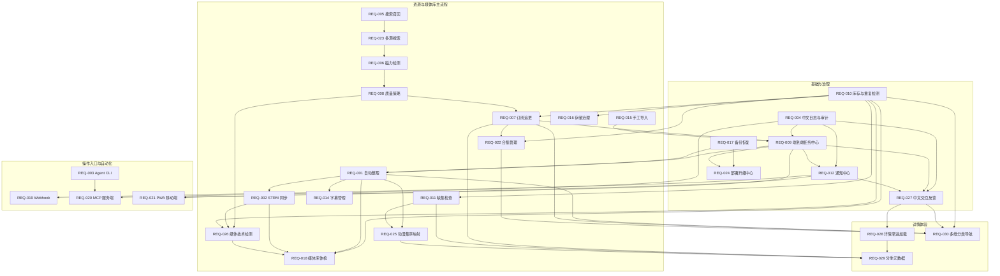

# Watch Assistant 产品需求目录

本目录用于保存正式产品需求。每个需求必须使用独立文件夹，不在同一 PRD 中混合多个可独立排期、验收或发布的能力。

## 目录规范

```text
docs/requirements/
  README.md
  REQ-001-short-name/
    README.md
  REQ-002-short-name/
    README.md
```

命名规则：

- 文件夹格式：`REQ-三位编号-英文短名`。
- 每个文件夹的主文档固定为 `README.md`。
- 一个需求只能有一个主编号；范围发生实质变化时更新版本，不重复创建近似需求。
- 实施计划放入 `docs/project-plans/`，不得与产品需求混放。
- 技术契约可放在需求文件夹内的 `contracts/`，验收证据可放在 `evidence/`。

## 文档模板

每份需求至少包含：

1. 文档元数据
2. 一句话定义
3. 背景与问题
4. 目标与非目标
5. 用户场景
6. 功能范围和需求编号
7. 业务规则或状态机
8. 管理界面、API 与数据要求
9. 安全、可靠性和可观测性要求
10. 验收标准
11. 分期建议
12. 风险与依赖
13. 待确认事项及建议默认值

状态统一使用：

- `草稿`
- `待评审`
- `已确认`
- `开发中`
- `待验收`
- `已完成`
- `已取消`

`开发中` 表示需求范围仍有实现工作；`待验收` 表示阶段实现或离线证据已具备，但生产、
外部依赖或完整验收证据仍未完成。测试夹具不能替代生产验收。总索引与各需求主文档的状态
必须保持一致。

当前发布核对：唯一发布分支为 `codex/publish-main`。发布前执行 `git fetch origin`，再用
`git rev-parse origin/codex/publish-main` 获取实际最新基线；本索引不固定可能过期的 commit，
需求状态也不等同于已打包、已部署或已完成生产验收。

当前基线已合入 PR #31、#32、#33、#34、#35、#36 和文档状态修正 PR #37；PR #31-#37 均已合入当前发布基线。
这些合入记录和离线测试不改变生产整理、真实媒体库、STRM 播放/清理、p115 live 或完整生产验收状态，永久删除继续关闭。

2026-08-02 状态复核是历史审查快照，锁定 `codex/integration-20260802@2c342d9`；该分支
不是 `codex/publish-main`。复核期间集成 ref 已前进到 `3afc8d3`，随后随 PR #30 合入发布基线；
这些记录保留历史真实性，但不把扫描、STRM、播放、清理或 115 写入升级为“已完成”或“已上线”。

优先级统一使用：

- `Must`：本需求成立所必需。
- `Should`：重要但可延后一个版本。
- `Could`：增强能力，不阻塞主流程。
- `Won't`：本期明确不做。

## 当前需求

| 编号 | 名称 | 状态 | 主文档 |
|---|---|---|---|
| REQ-001 | 115 影视库自动整理 | 待验收 | [查看](./REQ-001-115-library-organization/README.md) |
| REQ-002 | 115 STRM 全量与增量同步 | 待验收 | [查看](./REQ-002-115-strm-sync/README.md) |
| REQ-003 | Agent CLI 管理入口 | 开发中 | [查看](./REQ-003-agent-cli/README.md) |
| REQ-004 | 中文结构化日志与审计完善 | 待验收 | [查看](./REQ-004-chinese-structured-logging/README.md) |
| REQ-005 | 资源搜索召回与 PanSou 一致性提升 | 待验收 | [查看](./REQ-005-resource-search-recall/README.md) |
| REQ-006 | 磁力内容检测可靠性提升 | 待验收 | [查看](./REQ-006-magnet-inspection-reliability/README.md) |
| REQ-007 | 影视订阅与自动追更 | 待验收 | [查看](./REQ-007-subscriptions-auto-follow/README.md) |
| REQ-008 | 质量策略与自动选片 | 待验收 | [查看](./REQ-008-quality-profiles/README.md) |
| REQ-009 | 端到端任务中心 | 待验收 | [查看](./REQ-009-end-to-end-task-center/README.md) |
| REQ-010 | 115 影视库库存与重复检测 | 开发中 | [查看](./REQ-010-library-inventory-deduplication/README.md) |
| REQ-011 | 剧集缺集与完整度检查 | 待验收 | [查看](./REQ-011-episode-completeness/README.md) |
| REQ-012 | 通知中心 | 待验收 | [查看](./REQ-012-notification-center/README.md) |
| REQ-013 | Emby/Jellyfin/Plex 联动 | 暂不纳入 | 用户决定暂缓，不创建需求目录 |
| REQ-014 | 字幕管理中心 | 待验收 | [查看](./REQ-014-subtitle-management/README.md) |
| REQ-015 | 手工资源导入 | 待验收 | [查看](./REQ-015-manual-resource-import/README.md) |
| REQ-016 | 存储空间与清理治理 | 待验收 | [查看](./REQ-016-storage-governance/README.md) |
| REQ-017 | 配置、规则与数据库备份恢复 | 待验收 | [查看](./REQ-017-backup-restore/README.md) |
| REQ-018 | 媒体库质量体检 | 待验收 | [查看](./REQ-018-library-health-check/README.md) |
| REQ-019 | Webhook 与自动化接口 | 待验收 | [查看](./REQ-019-webhook-automation/README.md) |
| REQ-020 | Agent MCP 服务端 | 开发中 | [查看](./REQ-020-mcp-server/README.md) |
| REQ-021 | PWA 移动端管理 | 开发中 | [查看](./REQ-021-pwa-mobile/README.md) |
| REQ-022 | 影视合集与系列管理 | 待评审 | [查看](./REQ-022-collection-management/README.md) |
| REQ-023 | 多搜索源接入与聚合 | 待验收 | [查看](./REQ-023-multi-source-search/README.md) |
| REQ-024 | 部署、升级与兼容性中心 | 待验收 | [查看](./REQ-024-upgrade-compatibility-center/README.md) |
| REQ-025 | 动漫元数据与集序映射 | 待验收 | [查看](./REQ-025-anime-metadata-mapping/README.md) |
| REQ-026 | 媒体技术检测与损坏风险检查 | 待验收 | [查看](./REQ-026-media-technical-inspection/README.md) |
| REQ-027 | 中文交互提示与错误引导 | 待验收 | [查看](./REQ-027-chinese-ui-feedback/README.md) |
| REQ-028 | 影视详情首屏与资源渐进加载 | 待验收 | [查看](./REQ-028-progressive-media-detail/README.md) |
| REQ-029 | 剧集分季元数据与季度展示 | 待验收 | [查看](./REQ-029-season-specific-metadata/README.md) |
| REQ-030 | 多维内容分类与筛选导航 | 待评审 | [查看](./REQ-030-content-taxonomy-navigation/README.md) |

> `REQ-013` 编号保留，不参与当前排期；除非重新立项，否则不得复用该编号或创建对应需求目录。

## 需求关系



- REQ-001 产出的整理完成和目录变化事件是 REQ-002 增量同步的重要触发源。
- REQ-003 通过版本化 API 管理 REQ-001 和 REQ-002，不直接实现其业务规则。
- REQ-004 是其他需求的横向基础，必须先定义事件规范，再接入新增模块。
- REQ-005 优先解决 PanSou 已有资源在项目内漏召回的问题，并为后续检测提供更完整候选集。
- REQ-006 独立提升 qB 元数据检测成功率；检测失败不得反向隐藏 REQ-005 找到的资源。
- REQ-007、REQ-008、REQ-009 和 REQ-010 共同构成“发现、筛选、去重、推送、追踪”的自动追更闭环。
- REQ-011、REQ-014、REQ-016 和 REQ-018 基于整理结果与库存索引，补齐剧集、字幕、容量和质量治理。
- REQ-017 保护配置、规则和数据库；恢复流程不得隐式覆盖 115 真实文件。
- REQ-019 消费已登记业务事件，不替代任务和审批状态机。
- REQ-020 在 REQ-003 的 CLI、Agent Token 和 API 契约稳定后建设，并复用 REQ-004 审计规范。
- REQ-021 依赖 REQ-009 的任务状态和 REQ-012 的通知能力，离线只允许读取缓存。
- REQ-022 依赖 REQ-007 的订阅和 REQ-010 的库存状态，默认不移动或复制源文件。
- REQ-023 在 REQ-005 达到 PanSou 链路召回目标后建设，再向 REQ-006 和质量策略输出统一候选。
- REQ-024 复用 REQ-017 的可靠备份和 REQ-009 的任务排空机制；Web 应用不得获得 Docker Socket 或任意宿主机命令权限。
- REQ-025 扩展 REQ-001 与 REQ-011 的动漫集序语义，低置信度映射仍须人工确认。
- REQ-026 使用受控直链和分级探测提供实测技术字段，抽样通过不得等同于完整文件无损。
- REQ-027 与 REQ-004 共享稳定机器码、请求 ID和术语，但独立治理全站即时反馈、操作结果和下一步指引。
- REQ-028 将影视资料与资源搜索拆成独立加载边界，资源失败不得再阻塞或清空详情首屏。
- REQ-029 在 REQ-028 的局部加载基础上提供真实分季海报与简介，并与订阅、缺集和动漫映射使用同一季度身份。
- REQ-030 复用 REQ-001 的主分类术语和本地索引状态，但浏览标签与筛选不会直接改变 115 目录结构。
