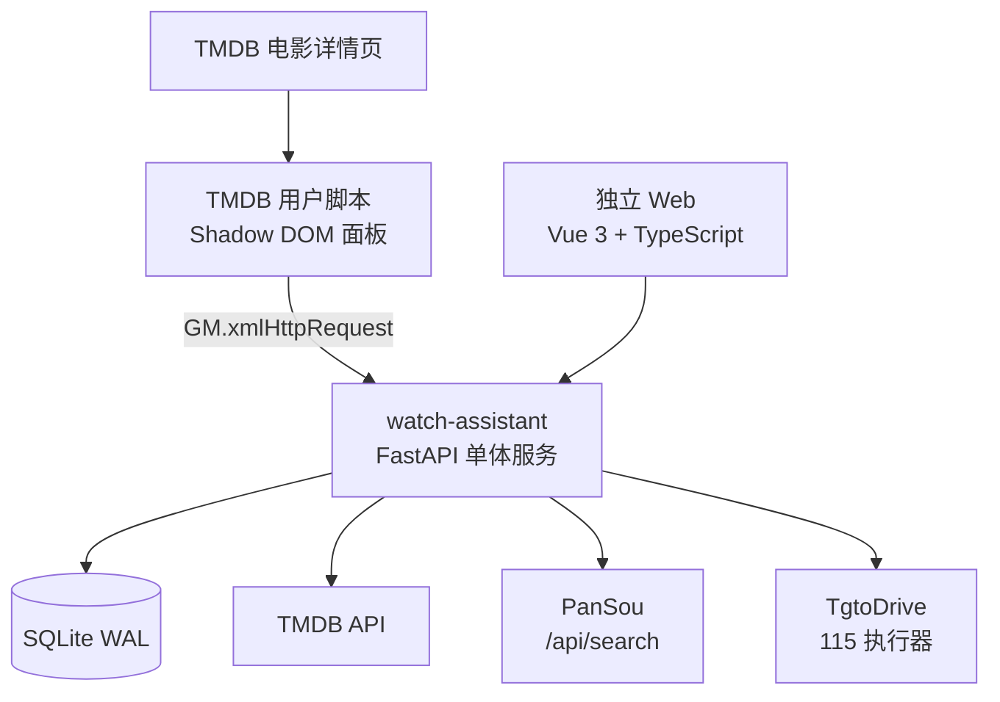

# 个人观影辅助工具设计规格

日期：2026-07-24  
状态：已确认设计，待实施计划  
范围：个人使用、局域网与 Tailscale 访问

## 1. 目标

在类似 TMDB 的电影详情页中聚合现有 PanSou 的磁力和网盘分享结果，并提供统一的 115 推送入口。

首版必须支持：

- 独立自建 Web 电影详情与资源页。
- TMDB 电影详情页用户脚本入口。
- PanSou 搜索结果统一展示。
- 资源名称、类型、文件大小、做种数、来源站点、采集时间。
- 磁力推送到 115 离线下载。
- 115 分享链接转存到 115。
- 推送任务状态、历史、幂等和失败重试。

PanSou 当前磁力结果缺少文件大小和做种数字段，因此缺失值统一显示为“未知”，不伪造为 0。

## 2. 非目标

- 不新增 Prowlarr、Jackett 或第二磁力索引器。
- 不实现公网多用户账号体系、角色权限和团队协作。
- 不引入 Redis、Celery、n8n 或独立消息队列。
- 不承诺 BT 下载进度；首版只确认 115 已接受任务。
- 不直接修改 TgtoDrive 数据库或调用未经验证的内部 Python 模块。

## 3. 已确认的运行环境

服务器已有：

- PanSou 容器 `ghcr.io/fish2018/pansou-web:latest`，宿主机端口 `8787`，容器内 HTTP 端口 `80`。
- TgtoDrive 容器 `walkingd/tgto123:latest`，宿主机端口 `8090`，容器内服务端口 `12366`。
- TgtoDrive 容器存在 115 Token、115 磁力离线目录和分享转存相关配置。
- TMDB API Key 由新服务端保存，不下放到浏览器。
- Docker 网络可用于让新服务直接访问两个现有容器。

PanSou 已验证接口：

```text
GET  /api/search?kw=<keyword>
POST /api/search
GET  /api/health
POST /api/check/links
```

PanSou 磁力结果当前主要包含 `url`、`note`、`source`、`datetime` 和可选图片字段；大小与做种数可能不存在。

TgtoDrive 的 115 提交和状态查询接口尚未形成稳定公开契约，必须作为实施前置门槛验证。

## 4. 总体架构



运行时只有一个新增容器 `watch-assistant`：

- FastAPI 提供 API。
- FastAPI 直接托管构建后的前端静态文件。
- 一个后台 worker 串行执行推送任务。
- Uvicorn 固定单 worker。
- SQLite 开启 WAL。

## 5. 搜索流程

1. Web 或用户脚本提交 TMDB ID。
2. FastAPI 读取 TMDB 标题、原名和年份。
3. 生成最多两个查询词，查询并发上限为 2，单请求超时 12 秒。
4. 调用 PanSou 的 `/api/search` 并合并结果。
5. 磁力按 BT infohash 去重；115 分享按分享 ID 去重。
6. 将规范化资源写入 `resources` 表。
7. 返回展示字段、`resource_id`、缓存年龄和警告。
8. PanSou 失败时，可返回不超过 24 小时的旧缓存，并明确标识为缓存结果。

排序规则：标题和年份匹配优先，其次清晰度标签和来源时间；缺失的大小与做种数不参与数值排序。

## 6. 统一资源模型

```text
Resource
  id: string
  kind: magnet | 115_share
  name: string
  size_bytes: integer | null
  seeders: integer | null
  source: string
  captured_at: datetime
  url: encrypted string
  password: encrypted string | null
```

前端不接收密码；是否返回原始链接只按展示需要决定，推送使用 `resource_id`。

## 7. 推送任务与状态机

```text
queued -> submitting -> accepted
                    -> needs_auth
                    -> failed
                    -> uncertain
```

语义：

- `queued`：已持久化，等待 worker。
- `submitting`：正在调用 TgtoDrive。
- `accepted`：115 已接受离线或转存任务，不代表下载完成。
- `needs_auth`：115/TgtoDrive 需要重新授权。
- `failed`：已确认本次提交失败。
- `uncertain`：服务崩溃或超时，无法确认远端是否已接受。

任务创建时在事务内复制不可变快照：原始链接、分享密码、资源类型和来源信息。首版使用 TgtoDrive 已配置的磁力与分享默认目录，不允许浏览器指定 115 目录。

幂等规则：同一 `resource_id` 在 24 小时内的活动或已接受任务直接复用；显式 `force` 才允许再次推送。

服务重启时：

- 遗留 `queued` 保持等待。
- 遗留 `submitting` 先查询远端历史。
- 能确认已接受则改为 `accepted`。
- 无法确认则改为 `uncertain`，禁止自动重提。

## 8. 自建 API

```text
POST /api/v1/auth/login
POST /api/v1/auth/logout
GET  /api/v1/auth/me
GET  /api/v1/health
GET  /api/v1/movies/{tmdb_id}
POST /api/v1/search
POST /api/v1/tasks
GET  /api/v1/tasks/{id}
GET  /api/v1/tasks
POST /api/v1/tasks/{id}/retry
```

请求边界：

```json
POST /api/v1/search
{"tmdb_id": 12345, "refresh": false}
```

```json
POST /api/v1/tasks
{"resource_id": "res_...", "force": false}
```

任务接口不接受任意 URL、分享密码或远程任务 ID。

Web 登录接口只设置会话 Cookie；用户脚本使用单独的 Bearer Token，不复用 Web 会话。

## 9. TgtoDrive 适配器

内部接口保持三个能力：

```python
submit_magnet(url) -> SubmissionResult
save_share(url, password) -> SubmissionResult
get_status(remote_ref) -> RemoteStatus
```

实施第一步必须用一条测试磁力和一条测试 115 分享验证提交与查询。如果只有提交接口而没有查询接口，则崩溃后必须进入 `uncertain`，不得自动重复提交。

## 10. 前端与 TMDB 用户脚本

独立 Web：

- Vue 3 + TypeScript + Vite。
- `/` 为搜索页，`/movie/:tmdbId` 为详情页。
- 桌面端用表格，手机端切换为资源卡片。
- 资源按“磁力”和“115 分享”筛选。
- 推送按钮显示 `queued`、`submitting`、`accepted`、`needs_auth`、`failed`、`uncertain`。
- 任务历史默认显示最近 50 条。

用户脚本：

- 匹配 `https://www.themoviedb.org/movie/*`。
- 用 `MutationObserver` 处理 TMDB SPA 路由变化。
- 用 Shadow DOM 隔离样式。
- 用 `GM.xmlHttpRequest` 调用自建 API。
- 只提交 TMDB ID 和 `resource_id`。
- 后端地址和 Bearer Token 保存在脚本管理器值存储中。
- 失败时只显示错误面板，不影响 TMDB 原页面。

## 11. 认证与安全

- Web 使用个人密码登录和 `HttpOnly`、`SameSite=Lax` 会话 Cookie。
- 用户脚本使用独立随机 Bearer Token，服务端只保存哈希。
- 写操作要求 CSRF Token 或自定义请求头。
- 搜索和推送分别限流：30 次/分钟和 10 次/分钟。
- 115 密码和磁力原文应用层加密，密钥由 Docker Secret 或权限为 600 的环境文件提供。
- TMDB API Key、115 密钥、Web 登录密码和用户脚本 Token 均属于服务端秘密，禁止写入前端构建产物。
- 日志禁止记录分享密码、完整磁力链接和 Token。
- 只访问配置中的 PanSou、TgtoDrive 和 TMDB 地址，禁止 SSRF 到任意目标。
- 115 分享链接推送前使用 PanSou `/api/check/links`；磁力不伪造有效性结果。
- Tailscale HTTPS 是推荐访问方式；若允许局域网 HTTP，Cookie 不设置 `Secure`，并在页面明确提示连接未加密。

## 12. 数据库

### resources

```text
id, kind, canonical_key, encrypted_url, encrypted_password,
name, size_bytes, seeders, source, captured_at, expires_at,
metadata_json, created_at
```

### search_cache

```text
cache_key, resource_ids_json, warnings_json, fetched_at, expires_at
```

缓存只保存资源 ID、非敏感展示字段和警告，不保存明文磁力链接或分享密码。`resources` 至少保留 30 天；仍被非终态任务引用的资源不得清理，终态任务历史保留 90 天。

### tasks

```text
id, resource_id, action,
encrypted_url_snapshot, encrypted_password_snapshot,
status, attempts, remote_ref, error_code, error_message,
lease_owner, lease_expires_at,
created_at, updated_at, submitted_at
```

## 13. 测试与验收

单元测试：

- PanSou 响应规范化、infohash 去重、分享 ID 去重。
- 缺失字段显示“未知”。
- URL 类型校验和任务状态转换。
- 幂等窗口与 `force` 行为。
- 缓存中不出现明文磁力链接、分享密码或 TMDB API Key。

集成测试：

- 使用脱敏 PanSou fixture。
- 使用假的 TgtoDrive HTTP 服务测试 accepted、needs_auth、failed 和超时。
- 测试 worker 在 submitting 阶段重启后的 uncertain 处理。

端到端测试：

- 独立 Web 的搜索、筛选、推送和任务历史。
- Web 登录、登出、过期会话和无效 Bearer Token。
- TMDB fixture 页面上的用户脚本注入和 SPA 路由切换。
- 桌面与移动视图。

真实验收：

- 一条测试磁力能被 115 接受。
- 一条测试 115 分享能完成转存提交。
- TgtoDrive 返回的远程标识可以被查询，或明确接受 `uncertain` 保护策略。

## 14. 实施顺序与阻塞门槛

1. 验证 TgtoDrive 提交/查询契约。
2. 建立 FastAPI、SQLite 和适配器骨架。
3. 完成 PanSou 搜索、标准化、缓存和 resources 持久化。
4. 完成任务状态机和 worker。
5. 完成独立 Web。
6. 完成 TMDB 用户脚本。
7. 完成安全、重启恢复和端到端验收。

在第 1 步未通过前，不开发“推送下载”按钮的真实执行逻辑。
